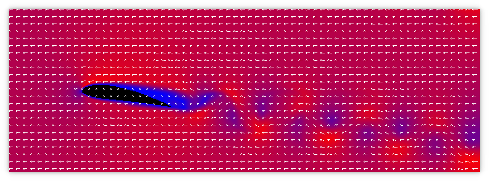
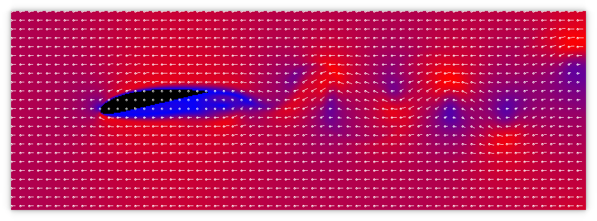
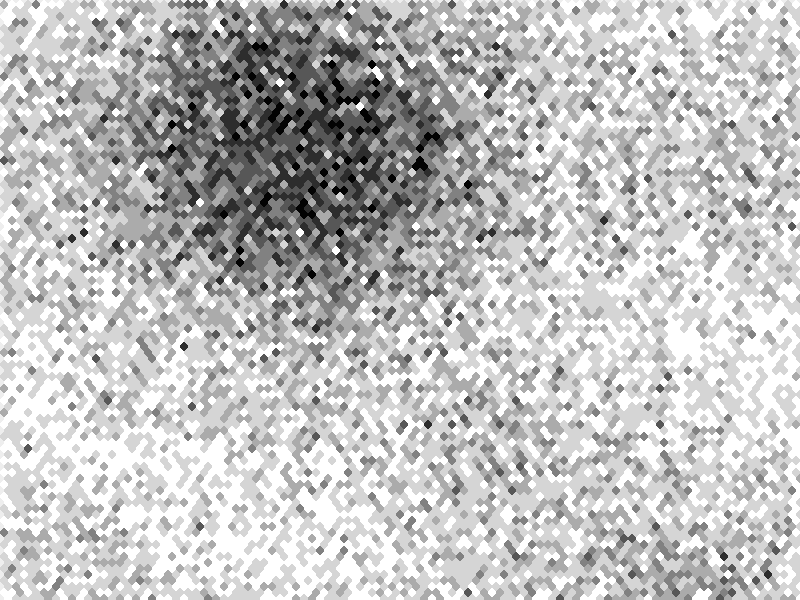
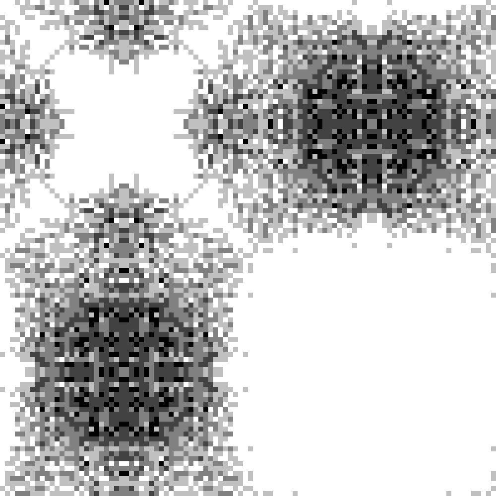
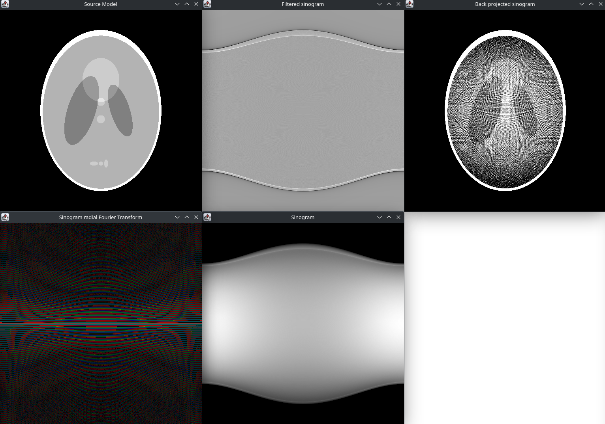

# Scientific computation

In this module, we simulated fluids, simulated a CT scanner with an FFT and much more.

For the full report please read 

# Highlights

## Fluid simulation

### Wing simulations

Here we simulated hydrofoils in high Reynolds fluids and calculated lift values from the relive forces over the foil. This came to the strange conclusion that the wing produces more lift with a negative AOA.

### Gas models

The FHP and HHP models use cellular automata. FHP uses a hex grid and more random movement, producing better diffusion and more accurate simulations

HHP uses a square grid. This produces voids in the gas due to the lack of random motion

### CT Scanner simulation

I took a low contrast Shepp–Logan phantom and simulated a CT scanner to produce a Sinogram. This was then filtered using various filters to clear up the final back propagation image.

